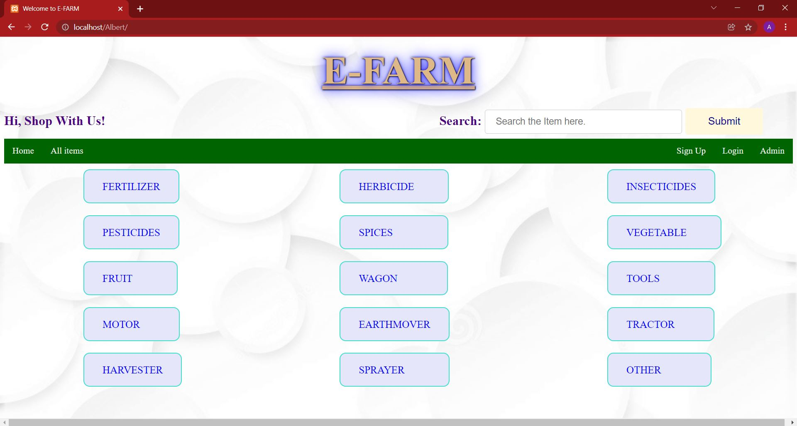
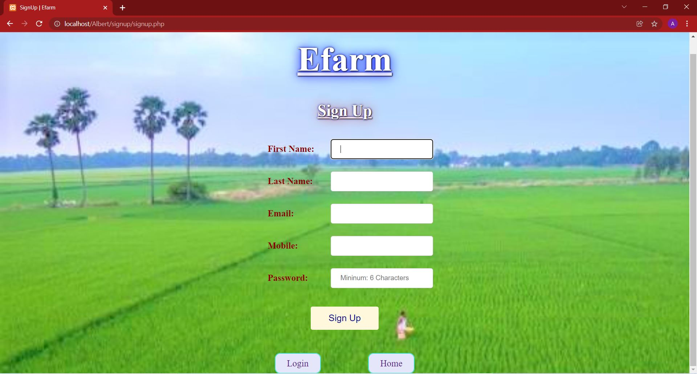
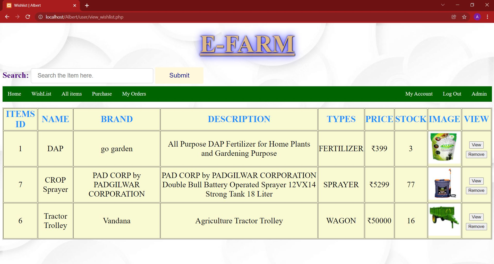
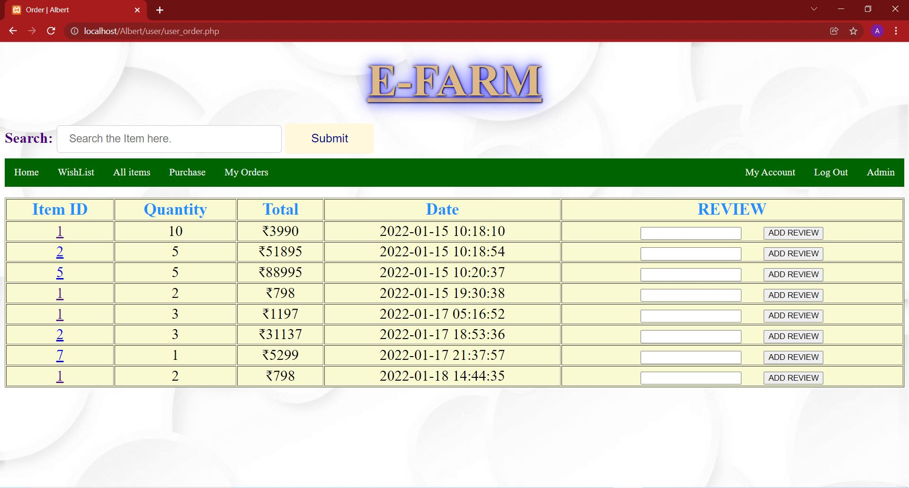
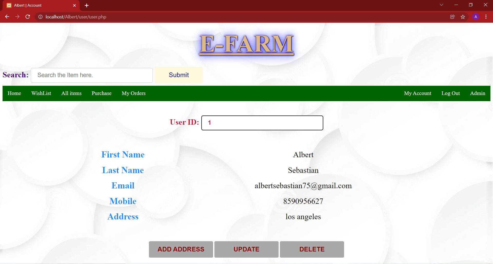
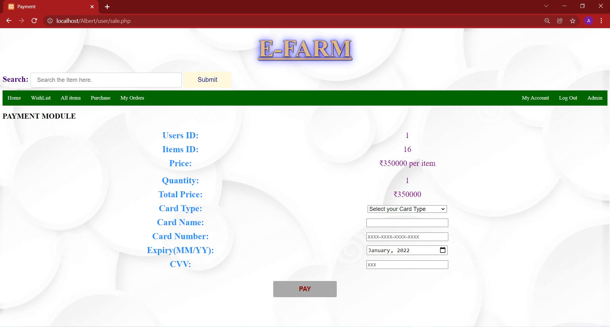

# Efarm
E-farm Shopping is a web application developed for farmers to automate the purchasing of agricultural equipment.

# Technology Used:
Front End: HTML, CSS 
Back End: PHP, MYSQL 

# Requirements
Download Visual Studio Code, XAMPP for Windows, and a browser. 
Start: `Apache` and `mysql` in XAMPP Control Panel. 
In http://localhost/phpmyadmin/, create a database called `alb` and import the file `alb.sql`. 
Run locally in browser: `http://localhost/foldername`
Login credentials for Admin: `Admin123`

# Stakeholders:
## Customers: 
The E-farm shopping website gives convenience access to a larger selection of quality products. Customers are able to search items they needed, view the items based on categories, wish list and buy them online. The customers are also able to add review on their purchase.

## Admin:
The admin will have direct, personalized communication with the customer and are also able to access their details quickly (email, purchase history etc.), in order, to make optimized business decisions, operations, products and services. Admin is able to manage the items in the store online

## Guest: 
The system allows greater privacy, in which one can view the details of the item including reviews and prices without login into the system. That is, without sharing any personnel information they can view the item details such as price, stock, description etc.

# Hosting
Create an AWS EC2 Instance and Connect to the Remote Desktop Protocol. Then Set Up the Project and Configure Security for necessary incoming and outgoing traffic. Then simply run for example `http://3.88.230.42/Efarm`(due to billing: I've stopped the instance).

# About Me

Albert Sebastian 
albertsebastian75@gmail.com 
8590956627 
Kerala, India

# Screenshoots

  <h2>Image Grid</h2>
  
Here's a grid of images in a 3 columns x 10 rows format:

  <table>
    <tr>
      <td align="center"></td>
      <td align="center"></td>
      <td align="center"></td>
    </tr>
    <tr>
      <td align="center"></td>
      <td align="center"></td>
      <td align="center"></td>
    </tr>
    <tr>
      <td align="center"></td>
      <td align="center"></td>
      <td align="center"></td>
    </tr>
    <tr>
      <td align="center"></td>
      <td align="center"></td>
      <td align="center"></td>
    </tr>
    <tr>
      <td align="center"></td>
      <td align="center"></td>
      <td align="center"></td>
    </tr>
    <tr>
      <td align="center"></td>
      <td align="center"></td>
      <td align="center"></td>
    </tr>
    <tr>
      <td align="center"></td>
      <td align="center"></td>
      <td align="center"></td>
    </tr>
    <tr>
      <td align="center"></td>
      <td align="center"></td>
      <td align="center"></td>
    </tr>
    <!-- Add more rows as needed -->
  </table>

